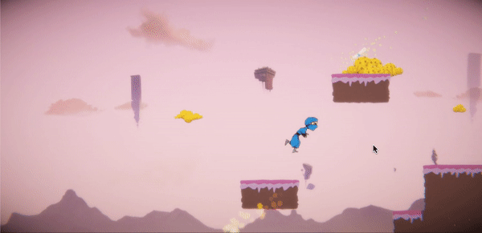

# GoodGameJam2019

This game was developed for the [Good Game Jam 2019](https://itch.io/jam/good-game-jam), hosted at [GoodGames Studios](https://www.goodgamestudios.com/) headquarters.

Developed in Unity2018.3.11f1

Find the game here!
https://lumley.itch.io/infinite-dreamin

## Story

A young scientist goes to bed and starts dreaming the craziest dreams about his everyday and professional problems.
To wake up from this dream he has to solve the problem and defeat it, otherwise he has to dream his dream repeatedly until he solves his issue.

## Controls

Keyboard arrows, space for jumping.

## Team
 - Tatjana Dumler
 - Roshan Jossy
 - Filippo Defendi
 - Sergio R. Lumley